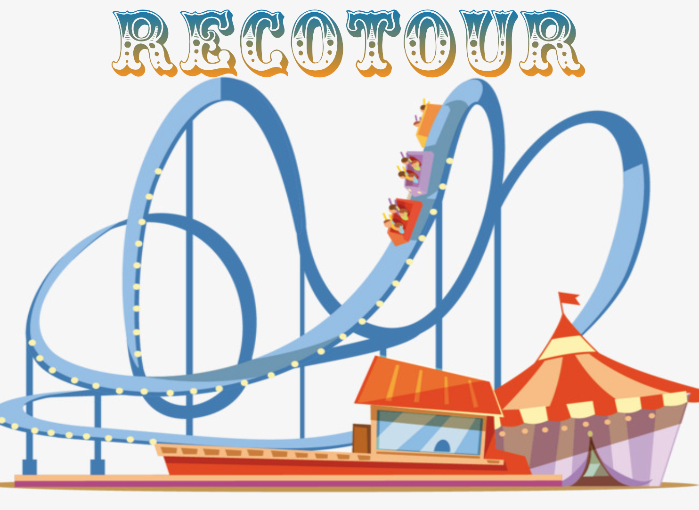

  

# RecoTour

This repo intends to be a tour through some recommendation algorithms in
python using various dataset. Companion posts are:

1. [Recotour: a tour through recommendation algorithms in python](https://medium.com/datadriveninvestor/recotour-a-tour-through-recommendation-algorithms-in-python-52d780628ab9)

2. [RecoTour II: neural recommendation algorithms](https://towardsdatascience.com/recotour-ii-neural-recommendation-algorithms-49733938d56e)

3. [RecoTour III: Variational Autoencoders for Collaborative Filtering with Mxnet and Pytorch](https://jrzaurin.github.io/infinitoml/2020/05/15/mult-vae.html).

The repo is organised as follows:

1. **recotour**: this is the original "tour" through recommendation algorithms
using the [Ponpare](https://www.kaggle.com/c/coupon-purchase-prediction)
coupon dataset. In particular, the algorithms included in the `recotour`
directory are:
    1. Data processing, with a deep dive into feature engineering
    2. Most Popular recommendations (the baseline)
    3. Item-User similarity based recommendations
    4. kNN Collaborative Filtering recommendations
    5. GBM based recommendations using `lightGBM` with a tutorial on how to optimize gbms
    6. Non-Negative Matrix Factorization recommendations
    7. Factorization Machines (Steffen Rendle 2010) recommendations using `xlearn`
    8. Field Aware Factorization Machines (Yuchin Juan, et al, 2016) recommendations using `xlearn`
    9. Deep Learning based recommendations (Wide and Deep, Heng-Tze Cheng, et al, 2016) using `pytorch`

  I have included a more modular (nicer looking) version of a possible final
  solution (described in `Chapter16_final_solution_Recommendations.ipynb`) in
  the directory `final_recommendations`.

  In addition, I have included an illustration of how to use other evaluation
  metrics apart from the one shown in the notebooks ( the mean average precision
  or MAP) such as the Normalized Discounted Cumulative Gain
  ([NDCG](https://en.wikipedia.org/wiki/Discounted_cumulative_gain)). This can
  be found in `using_ncdg.py` in the directory `py_scripts`.

In addition, there are other, DL-based recommendation algorithms that use
mainly the [Amazon Reviews](http://jmcauley.ucsd.edu/data/amazon/) dataset,
in particular the 5-core Movies and TV reviews. These are:

2. **neural_cf**: Neural Collaborative Filtering (Xiangnan He et al., 2017)
3. **neural_graph_cf**: Neural Graph Collaborative Filtering (Wang Xiang et al. 2019)
4. **mult-vae**: Variational Autoencoders for Collaborative Filtering (Dawen Liang et al,. 2018)

**The core of the repo are the notebooks** in each directory. They intend to
be self-contained and in consequence, there is some of code repetition. The
code is, of course, "notebook-oriented". The notebooks have plenty of
explanations and references to relevant papers or packages. My intention was
to focus on the code, but you will also find some math.

I hope the code here is useful to someone. If you have any idea on how to
improve the content of the repo, or you want to contribute, let me know.